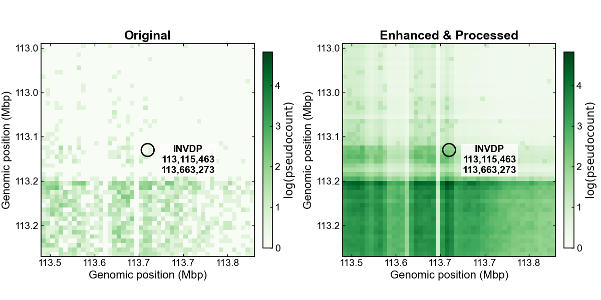
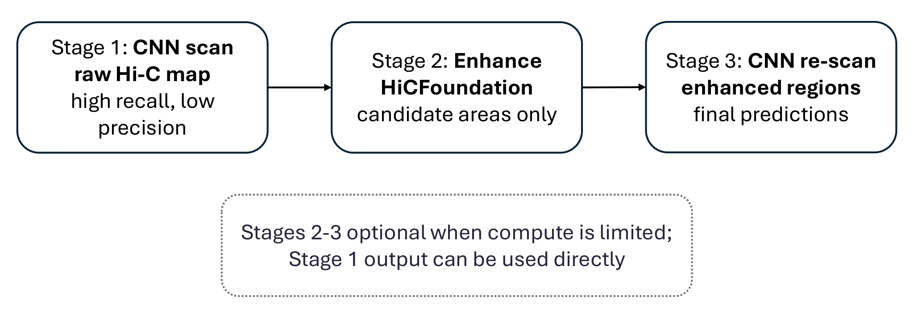

# HiCT Patterns

**Detecting structural variation breakpoints in Hi-C contact maps with a foundation-model-enhanced pipeline.**

---

Structural variations (SVs) — deletions, duplications, inversions, and translocations — are among the principal drivers of genome evolution, phenotypic diversity, and disease susceptibility. Because SVs alter the linear adjacency of genomic loci, they leave characteristic, non-local signatures in Hi-C contact matrices that are not directly accessible from linear sequence alignment alone: when interaction reads from one species are aligned to the genome of another, discrepancies in chromosomal segment order manifest as interaction patterns between genomically distal regions, revealing large-scale interspecies rearrangements.

Existing deep-learning methods for Hi-C-based SV detection were developed and benchmarked primarily on intraspecies, somatic rearrangements and generalize poorly to the comparative, cross-species setting, where baseline signal distributions differ across species due to karyotype and chromatin-organization differences, and where annotated interspecies training data are essentially absent.



HiCT Patterns addresses this setting with a three-stage pipeline. A first-stage convolutional classifier scans a Hi-C map and flags candidate breakpoint regions at high recall and comparatively low precision. These candidate regions are then passed to [HiCFoundation](https://github.com/liu-bioinfo-lab/HiCFoundation), a pretrained Hi-C foundation model, for targeted, genome-scale resolution enhancement — rather than enhancing an entire chromosome-pair matrix, which would be computationally prohibitive at genome scale, enhancement is restricted to the neighborhoods of first-stage candidates. A second classification pass on the enhanced regions then yields the final breakpoint predictions. Combined with distance-dependent normalization and dual-map (query–reference) input, this staged use of a pretrained foundation model sharpens rearrangement-associated contact discontinuities and substantially improves precision and F1 score over EagleC2, the current state-of-the-art interspecies SV detector, evaluated across the human T2T-CHM13 reference and five ape genomes.



This repository provides the pipeline as a set of reproducible Nextflow workflows for applying Hi-C-based, foundation-model-assisted breakpoint detection to comparative and evolutionary genomics datasets.

---

## Installation

HiCT Patterns is distributed and run as a **Nextflow pipeline**. Every processing step — the HICT Patterns modules and the HiCFoundation enhancement step — runs inside its own container, so you do not need to install any Python environments, ML frameworks, or the HiCFoundation codebase yourself.

### Prerequisites

You need two things on the machine (or cluster) that will run the pipeline:

1. **[Nextflow](https://www.nextflow.io/docs/latest/install.html)** (requires Java 11 or later)
   ```bash
   curl -s https://get.nextflow.io | bash
   sudo mv nextflow /usr/local/bin/
   ```
2. And one of two options:
   - **[Docker](https://docs.docker.com/engine/install/)** — used to build/provide the container images referenced by the pipeline.
   - **[Singularity](https://docs.sylabs.io/guides/latest/user-guide/quick_start.html#quick-installation) / Apptainer** — alternative to Docker

   Choose between (`docker.enabled = true` / `singularity.enabled = true` in `nextflow.config`)

No manual container building or environment setup is required beyond this: the containers referenced in `nextflow.config` are pulled automatically the first time each workflow runs.

### Getting the pipeline

This repository uses [Git LFS](https://git-lfs.com/) for large files, including model checkpoints. Install and initialize Git LFS **before** cloning so these files are downloaded as their actual binary contents rather than small text pointer files:

```bash
git clone https://github.com/Dv1t/HICT_Patterns.git
cd HICT_Patterns/pipeline
```

If Git LFS was not available when you cloned the repository, install it with your system package manager and then retrieve the LFS-managed files:

```bash
cd HICT_Patterns
git lfs install
git lfs pull
cd pipeline
```

Verify the checkout with `git lfs ls-files`. In particular,
`HiCFoundation/hicfoundation_model/hicfoundation_resolution.pth.tar` must be a
large binary checkpoint, not a small file whose first line is
`version https://git-lfs.github.com/spec/v1`.

All Nextflow commands below are expected to be run from the `pipeline/` directory, so that the relative paths in `nextflow.config` resolve correctly.

### Model weights

Download the trained HICT Patterns model weights and unzip/copy them into the repository's `weights/` directory (i.e. `../weights/` relative to `pipeline/`).

For each set of weights you plan to use, create a tab-separated file listing each model checkpoint together with the resolution it was trained for, e.g.:

```text
../weights/model_15000.pt	15000
../weights/model_25000.pt	25000
../weights/model_50000.pt	50000
```

### Input data

Input Hi-C maps must be in `.mcool` format with 50 Kb, 10 Kb, and 5 Kb resolutions (and 1 Kb if you intend to search at that resolution). If your `.mcool` file doesn't already have these resolutions, generate them with [`cooler zoomify`](https://cooler.readthedocs.io/en/latest/cli.html#cooler-zoomify).

---

## Running the pipeline

Two Nextflow workflows are provided in the `pipeline/` directory.

### Three-stage inference with already-trained weights

Use `three_stage_inference.nf` when you already have trained HICT Patterns weights and just want to run breakpoint detection.

```bash
cd pipeline

nextflow run three_stage_inference.nf \
  --cooler_path /path/to/Sample.mcool \
  --clean_cooler_path /path/to/CHM13_15_25_50.mcool \
  --stage3_clean_cooler_path /path/to/CHM13_Sample_enhanced.mcool \
  --weights_paths ../weights/Sample_weights_paths.tsv \
  --stage3_weights_paths ../weights/Sample_weights_paths.tsv \
  --label Sample \
  --hicfoundation_sif /path/to/hicfoundation_image.sif \
  --hicfoundation_inference ../HiCFoundation/inference.py \
  --hicfoundation_model ../HiCFoundation/hicfoundation_model/hicfoundation_resolution.pth.tar
```

- `--weights_paths` is used by Stage 1 and `--stage3_weights_paths` is used by Stage 3. They may point to different trained model sets; if `--stage3_weights_paths` is omitted, Stage 3 reuses the Stage 1 weights.
- The workflow runs, in order: (1) original-map HICT Patterns inference, (2) HiCFoundation-based enhancement of the Stage 1 candidate regions, (3) HICT Patterns inference on the enhanced map.
- Results are written to `${label}_three_stage_output/`, including `results/` (breakpoint calls) and `enhanced/` (enhanced `.mcool`).

### Train once, then run all three stages

Use `train_three_stage_inference.nf` when the HICT Patterns model needs to be trained before inference.

The training metadata file must contain one tab-separated record per training sample:

```text
training_label<TAB>sv_mcool<TAB>clean_mcool<TAB>answer_csv
```

For example:

```text
Bonobo_Chm	/path/Bonobo_Chm.mcool	/path/CHM13_15_25_50.mcool	/path/Bonobo_answer.csv
Gor_Chm	/path/Gor_Chm.mcool	/path/CHM13_15_25_50.mcool	/path/Gor_answer.csv
```

Launch training followed by sequential three-stage inference with:

```bash
cd pipeline

nextflow run train_three_stage_inference.nf \
  --input_train_cooler_paths /path/training_samples.tsv \
  --cooler_path /path/to/Sample.mcool \
  --clean_cooler_path /path/to/CHM13_15_25_50.mcool \
  --stage3_clean_cooler_path /path/to/CHM13_Sample_enhanced.mcool \
  --label Sample \
  --num_epoch 160 \
  --hicfoundation_sif /path/to/hicfoundation_image.sif \
  --hicfoundation_inference ../HiCFoundation/inference.py \
  --hicfoundation_model ../HiCFoundation/hicfoundation_model/hicfoundation_resolution.pth.tar
```

The model is trained once per resolution; the resulting weights are then reused by both Stage 1 and Stage 3 (Stage 3 does not train a second model). Training outputs are written to `${label}_trained_three_stage_output/training/`, inference results to `results/`, and the HiCFoundation output to `enhanced/`.

Runnable, environment-variable-based launchers and metadata templates for both setups are available in [`pipeline/examples/`](pipeline/examples/): `run_existing_weights.sh` and `run_train_then_infer.sh`.

### Output

Breakpoint calls are written as a `.csv` table with three columns: the two whole-genome-range coordinates delimiting the structural variation, and the predicted SV class.

---

## Repository layout

The publication-facing implementation is in [`pipeline/`](pipeline/). Its sibling inputs and reusable resources are kept in `configs/`, `data/`, `weights/`, and `HiCFoundation/`. Analysis notebooks are in [`notebooks/`](notebooks/), while metric exports from `plot_metrics.ipynb` are collected in [`figures/metrics/`](figures/metrics/).

Retained historical scripts, environments, logs, and intermediate result bundles are organized under [`misc/`](misc/) and are not required for the standard Nextflow workflows.

## Notes on this pipeline

Both workflows require Nextflow with Singularity enabled, Cooler, and the HiCFoundation environment — all of which are supplied through the containers referenced in `nextflow.config`, so the only local installation requirements are Nextflow, Docker, and Singularity as described above.

Stages 2–3 (foundation-model enhancement and re-scan) are optional when compute is limited: the Stage 1 output can be used directly as a high-recall, lower-precision candidate set.
